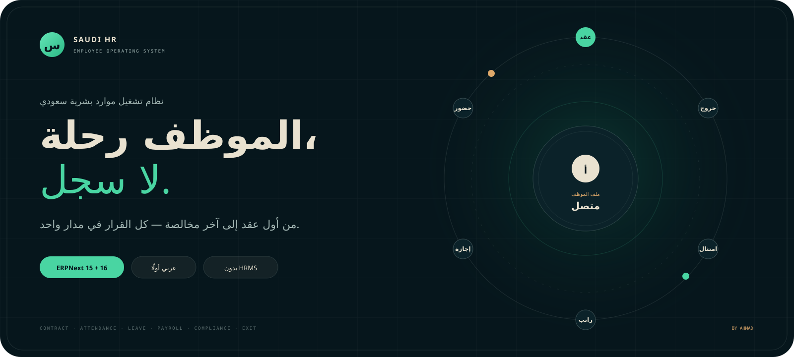
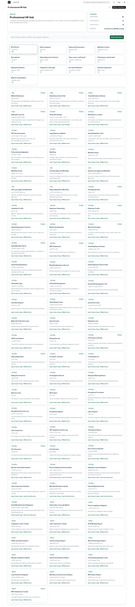
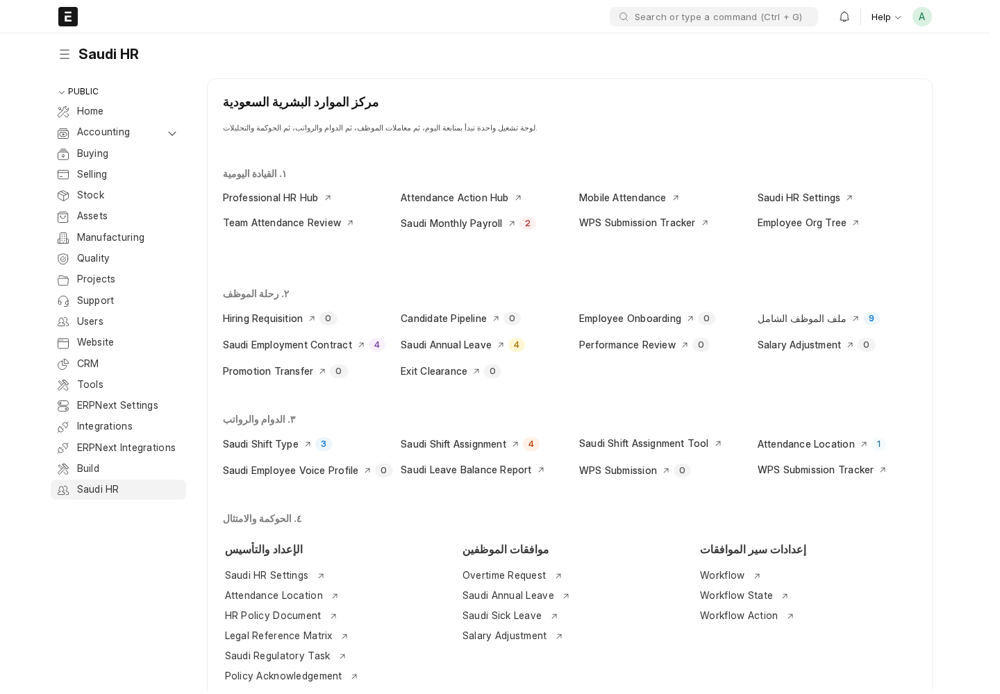
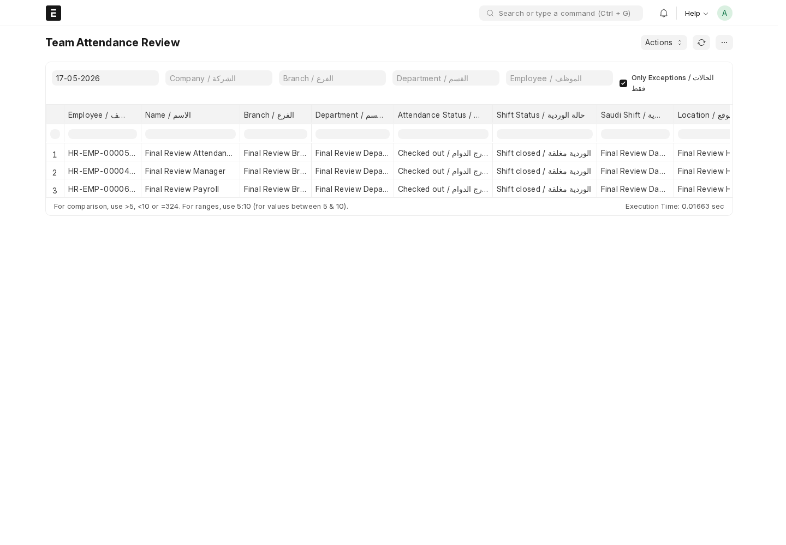
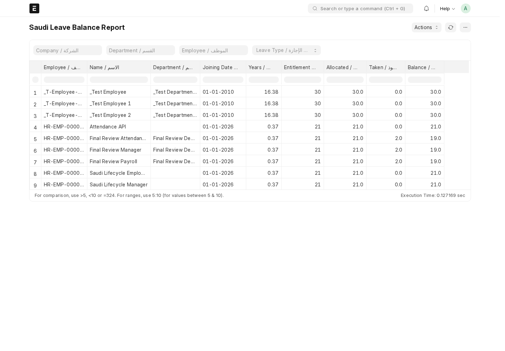

<div align="center" dir="rtl">

<a href="https://ahmadmdm.github.io/hr-saudi-arabia-erpnext/">
  
</a>

<br>

[](https://github.com/ahmadmdm/hr-saudi-arabia-erpnext/releases/tag/v1.19.3)


[](https://github.com/ahmadmdm/hr-saudi-arabia-erpnext/actions/workflows/quality.yml)

### نظام تشغيل دورة الموظف السعودية داخل ERPNext

**[ادخل التجربة التفاعلية](https://ahmadmdm.github.io/hr-saudi-arabia-erpnext/)** &nbsp;·&nbsp; [ثبّت الآن](#التثبيت) &nbsp;·&nbsp; [اكتشف الرحلة](#دورة-الموظف-داخل-النظام) &nbsp;·&nbsp; [تواصل](#صاحب-المشروع)

</div>

## ما هو Saudi HR؟

**Saudi HR** تطبيق موارد بشرية وامتثال سعودي يعمل داخل ERPNext. يجمع بيانات الموظف وعقده وحضوره وإجازاته وراتبه ووثائقه في سجل تشغيلي واحد، ولا يتطلب تثبيت HRMS.

> **الموظف ليس صفًا في جدول.** كل حركة في ملفه تؤثر في استحقاق أو التزام أو قرار يحتاج إلى تفسير ومراجعة.

يعطي التطبيق فريقك صورة واحدة عن الحدث وسببه ومسؤول الإجراء التالي. تبدأ الرحلة من طلب التوظيف، وتستمر حتى المخالصة ومكافأة نهاية الخدمة.

### ما تحصل عليه

- **تجربة عربية:** واجهات ومصطلحات واتجاه كتابة من اليمين إلى اليسار
- **ملف موظف شامل:** الهوية والعمل والعقد والوثائق والحضور والراتب في سياق واحد
- **تشغيل مستقل:** وظائف الموارد البشرية الأساسية دون الاعتماد على HRMS
- **سياسات دقيقة:** تخصيص الإجازات حسب الشركة أو القسم أو الموظف
- **رواتب قابلة للمراجعة:** استيراد Excel مع التحقق من الإضافي والخصومات وصافي الراتب
- **امتثال موثق:** مسؤوليات ومواعيد وأدلة وسجل تغييرات قابل للتدقيق

> [!IMPORTANT]
> يساعد التطبيق على تشغيل إجراءات مستندة إلى متطلبات العمل السعودي. راجع المستشار القانوني عند تفسير حالة خاصة أو اعتماد قرار نظامي.

## اختر مسارك

ابدأ من المسار الأقرب إلى مسؤوليتك، ثم انتقل إلى التفاصيل عند الحاجة.

| دورك | ما تنجزه داخل التطبيق | نقطة البداية |
|:--|:--|:--|
| **مدير الموارد البشرية** | تدير ملف الموظف والعقد والإجازات والتهيئة ونهاية الخدمة | `/app/professional-hr-hub` |
| **مسؤول الرواتب** | تستورد المسير وتراجع الإضافي والخصومات والتأمينات وحماية الأجور | `/app/saudi-monthly-payroll` |
| **مسؤول الامتثال** | تتابع الوثائق والتصاريح والتنبيهات والمخالفات وأدلة الإغلاق | `/app/saudi-hr` |
| **مدير النظام** | تثبّت التطبيق وتضبط الصلاحيات والنسخ الاحتياطي والتحديثات | [دليل النشر](docs/deployment.md) |

## دورة الموظف داخل النظام

يربط التطبيق مراحل دورة الموظف بدل توزيعها على ملفات وقوائم منفصلة.

| المرحلة | السجلات والإجراءات | النتيجة التشغيلية |
|:--|:--|:--|
| **1. التخطيط والتوظيف** | طلب التوظيف، المرشح، المقابلة، التقييم والعرض | قرار توظيف موثق |
| **2. العقد والتهيئة** | العقد، فترة التجربة، الوثائق، العهد وخطة الانضمام | بداية عمل مكتملة |
| **3. الحضور والإجازات** | الوردية، الموقع، البصمة، الغياب وسياسة الإجازة | استحقاق يومي قابل للتفسير |
| **4. الرواتب والالتزامات** | المسير، الإضافي، الخصومات، القروض، التأمينات وحماية الأجور | راتب محسوب وقابل للمراجعة |
| **5. العلاقات والامتثال** | السياسات، الإقرارات، التحقيقات، التظلمات والتفتيش | إجراء له مسؤول وموعد ودليل |
| **6. نهاية الخدمة** | الإنهاء، الإخلاء، المقابلة، المكافأة والمخالصة | خروج مكتمل دون سجلات معلقة |

## شاهد سير العمل

تعرض الصور التالية مساحات العمل والتقارير الفعلية داخل التطبيق.

<a href="https://ahmadmdm.github.io/hr-saudi-arabia-erpnext/#journey">
  
</a>

| مساحة العمل | مراجعة الحضور | رصيد الإجازات |
|:--:|:--:|:--:|
|  |  |  |

شاهد بقية الشاشات في [الجولة المرئية](docs/visual-tour.md)، أو افتح [التجربة التفاعلية](https://ahmadmdm.github.io/hr-saudi-arabia-erpnext/).

## القدرات الرئيسية

يغطي التطبيق العمليات اليومية والرقابة النظامية من خلال وحدات مترابطة.

| المجال | ما يدعمه التطبيق |
|:--|:--|
| **ملف الموظف** | البيانات الشخصية والوظيفية، العقد، الراتب، الوثائق، العهد والسجل الزمني |
| **التوظيف** | الاحتياج، المرشحون، المقابلات، العروض، التهيئة وفترة التجربة |
| **العقود** | العقود المحددة وغير المحددة، التجديد، التنبيهات والتاريخ التعاقدي |
| **الحضور** | الورديات، الحضور المحمول، المواقع، التأخر، الغياب والتسويات |
| **الإجازات** | سياسات على مستوى الشركة مع استثناءات للقسم أو الموظف |
| **الرواتب** | المسير الشهري، الإضافي، الخصومات، القروض والتسويات والاستيراد من Excel |
| **الالتزامات السعودية** | المؤسسة العامة للتأمينات الاجتماعية (GOSI)، نظام حماية الأجور (WPS) ونطاقات |
| **الامتثال** | الإقامات، التصاريح، التفتيش، المخالفات، الإجراءات التصحيحية وأدلة الإغلاق |
| **نهاية الخدمة** | الإنهاء، الإخلاء، المقابلة، المكافأة والمخالصة النهائية |

## استيراد الرواتب من Excel

يدعم مسير الرواتب القالب المعتمد والقوالب القديمة المتداولة لدى العملاء. يعرض التطبيق معاينة قبل الحفظ حتى تراجع النتائج دون تغيير المسير.

يتحقق الاستيراد من:

- مطابقة الموظف بالرقم الوظيفي ثم الحقول البديلة المعتمدة
- الإضافي والخصومات والراتب الإجمالي وصافي الراتب
- الأعمدة الإلزامية والقيم السالبة والمعادلة المحاسبية
- الصفوف المتطابقة، مع احتساب قيمها مرة واحدة
- الأسماء غير المرتبطة، مع تقرير فجوات وخيار إنشاء الموظفين وفق الإعدادات
- مراكز التكلفة والأقسام قبل إنشاء سجلات الرواتب

نزّل القالب من شاشة **مسير الرواتب الشهري السعودي**، ثم نفّذ **معاينة الملف** قبل **استيراد الملف المرفق**.

## التثبيت

هذه الحزمة مخصصة لـ **ERPNext v15**. الإصدار المختبر هو Saudi HR `1.19.3`، ويحمل وسم `v1.19.3`.

### المتطلبات

- موقع ERPNext v15 يعمل قبل تثبيت التطبيق
- صلاحية تشغيل أوامر Bench على الخادم
- نسخة احتياطية قبل التثبيت على موقع إنتاجي

نفّذ الأوامر التالية من مجلد Bench. تستنسخ الأوامر فرع v15، وتثبّت التطبيق، ثم تطبق مخطط قاعدة البيانات وتبني الأصول.

```bash
cd ~/frappe-bench
bench get-app --branch version-15 \
  https://github.com/ahmadmdm/hr-saudi-arabia-erpnext.git
bench --site erp.example.com install-app saudi_hr
bench --site erp.example.com migrate
bench build --app saudi_hr
bench restart
```

افتح المسارات التالية بعد اكتمال التثبيت:

| المسار | الاستخدام |
|:--|:--|
| `/app/saudi-hr` | مساحة العمل الرئيسية |
| `/app/professional-hr-hub` | مركز تشغيل الموارد البشرية |
| `/app/attendance-action-hub` | مراجعة الحضور واتخاذ الإجراء |
| `/mobile-attendance` | تسجيل الحضور من الجوال |

> [!TIP]
> لتثبيت التطبيق على ERPNext v16، استخدم [فرع version-16](https://github.com/ahmadmdm/hr-saudi-arabia-erpnext/tree/version-16) واتبع [دليل التثبيت](docs/installation.md).

## شغّل أول سيناريو تجريبي

استخدم شركة وموظفًا تجريبيين قبل إدخال بيانات الإنتاج. يختبر هذا السيناريو الترابط بين الملف والعقد والحضور والإجازة والراتب.

1. **أنشئ الهيكل:** أضف الشركة والفرع والقسم والوظيفة والموقع
2. **اضبط السياسات:** عرّف الوردية والإجازات ونوع العقد وتنبيهات الوثائق
3. **أضف موظفًا:** أكمل هويته ووظيفته وعقده ووثائقه ومكونات راتبه
4. **سجّل الحركة:** أضف حضورًا وتأخرًا أو إضافيًا، ثم قدّم طلب إجازة واعتمده
5. **أنشئ المسير:** راجع أثر الحضور والإجازة والإضافي والخصومات على الراتب
6. **راجع الامتثال:** افحص التنبيهات والمستندات المستحقة وسجل الأدلة
7. **اختبر الخروج:** أنشئ إنهاء خدمة تجريبيًا وراجع المكافأة والمخالصة

يوضح [دليل البيانات التجريبية](docs/demo-data.md) القيم المقترحة والنتائج المتوقعة. يعرض [دليل التشغيل الحي](https://ahmadmdm.github.io/hr-saudi-arabia-erpnext/#tutorial) المسار حسب الدور.

## التوثيق حسب المهمة

استخدم الدليل المرتبط بالمهمة التي تريد تنفيذها.

| المهمة | الدليل |
|:--|:--|
| تثبيت التطبيق والتحقق منه | [دليل التثبيت](docs/installation.md) |
| نشر التطبيق وضبط الصلاحيات | [دليل النشر](docs/deployment.md) |
| تخصيص الإجازة لشركة أو قسم أو موظف | [تخصيص سياسات الإجازات](docs/leave-policy-customization.md) |
| إنشاء بيانات آمنة للتجربة | [دليل البيانات التجريبية](docs/demo-data.md) |
| ربط المتطلبات النظامية بالوظائف | [مصفوفة الامتثال](docs/LEGAL_COMPLIANCE_MATRIX.md) |
| مراجعة نطاق الاختبارات ونتائجها | [خطة الاختبار](docs/COMPREHENSIVE_TEST_PLAN.md) و[نتائج الاختبار](docs/COMPREHENSIVE_TEST_RESULTS.md) |
| إعداد النسخ الاحتياطي والاستعادة | [دليل التعافي من الكوارث](docs/DISASTER_RECOVERY.md) |
| مراجعة التطبيقات والمكتبات المطلوبة | [عقد التبعيات](DEPENDENCIES.md) |

## التوافق والإصدارات

يحافظ المشروع على فرعين يقدمان السلوك الوظيفي نفسه مع مراعاة اختلافات ERPNext.

| الفرع | إصدار ERPNext | الإصدار المستقر | رابط الإصدار |
|:--|:--:|:--:|:--|
| `version-15` | v15 | `1.19.3` | [`v1.19.3`](https://github.com/ahmadmdm/hr-saudi-arabia-erpnext/releases/tag/v1.19.3) |
| `version-16` | v16 | `1.19.3` | [`v1.19.3-v16`](https://github.com/ahmadmdm/hr-saudi-arabia-erpnext/releases/tag/v1.19.3-v16) |

راجع [سجل التغييرات](CHANGELOG.md) قبل التحديث، وخذ نسخة احتياطية من قاعدة البيانات والملفات قبل تشغيل `migrate`.

## الجودة والحدود التشغيلية

يشمل فحص الجودة التحقق البنيوي، وفحص Python، واختبارات التطبيق، وسلامة فروق Git.

```bash
python scripts/validate_quality.py
ruff check saudi_hr --select F
pytest -q
git diff --check
```

ضع الحدود التالية ضمن خطة التشغيل:

- يحتاج الربط الحي مع قوى والتأمينات ومدد ومقيم إلى بيانات اعتماد وقنوات معتمدة من كل جهة
- يجهز التطبيق المخرجات الحكومية للمراجعة، ولا يرسلها إلى الجهة دون تكامل معتمد
- تحمي صلاحيات المستندات والسجلات بيانات الرواتب والملف الشامل، ويجب مراجعتها قبل الإنتاج
- تراقب المهام المجدولة العقود والإقامات والتصاريح والمهل، ويجب مراقبة العامل المجدول في الخادم
- لا يستبدل التطبيق المراجعة القانونية أو المحاسبية للحالات غير القياسية

## الدعم والمساهمة

افتح [بلاغًا في GitHub Issues](https://github.com/ahmadmdm/hr-saudi-arabia-erpnext/issues) وأرفق إصدار التطبيق وخطوات إعادة المشكلة والنتيجة المتوقعة ودليلًا مرئيًا بعد إخفاء البيانات الشخصية.

قبل إرسال مساهمة برمجية:

1. طبّق السلوك نفسه على فرعي `version-15` و`version-16`
2. حافظ على فروق التوافق الضرورية بين الإصدارين
3. شغّل فحوص الجودة والاختبارات في الفرعين
4. حدّث التوثيق وسجل التغييرات عند تغير السلوك

## صاحب المشروع

<div dir="rtl">

**Ahmad**<br>
صاحب المشروع والمشرف على تجربة الموارد البشرية السعودية.<br>
[ahmad8@outlook.com](mailto:ahmad8@outlook.com)

</div>

<div align="center" dir="rtl">

العقد يعرف الراتب · الحضور يعرف الاستحقاق · الامتثال يعرف الموعد

[التجربة التفاعلية](https://ahmadmdm.github.io/hr-saudi-arabia-erpnext/) · [الإصدارات](https://github.com/ahmadmdm/hr-saudi-arabia-erpnext/releases) · [الترخيص GPL-3.0](LICENSE)

</div>
