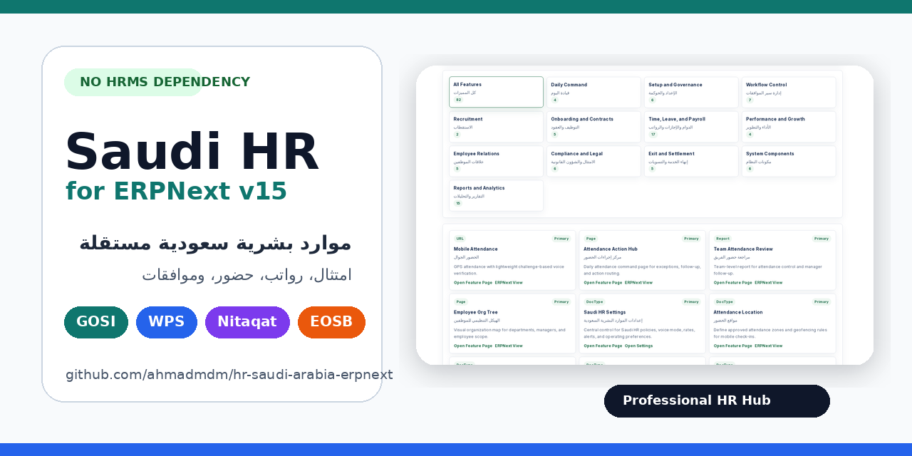
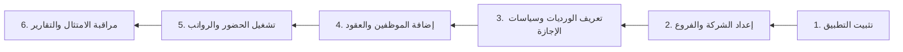

<div align="center" dir="rtl">



# Saudi HR for ERPNext

### الموارد البشرية السعودية، من ملف الموظف إلى الامتثال — في مساحة تشغيل واحدة.

نظام مستقل ومفتوح المصدر لإدارة دورة حياة الموظف وفق احتياجات المنشآت في المملكة، مبني فوق **Frappe + ERPNext** ولا يتطلب HRMS.

[](https://github.com/ahmadmdm/hr-saudi-arabia-erpnext/releases/tag/v1.18.0-v16)


[](https://github.com/ahmadmdm/hr-saudi-arabia-erpnext/actions/workflows/quality.yml)
[](LICENSE)

**[ابدأ الجولة التفاعلية](https://ahmadmdm.github.io/hr-saudi-arabia-erpnext/)** · [التثبيت](#-التثبيت-السريع) · [القدرات](#-منظومة-واحدة-لكامل-الدورة) · [التوثيق](#-مركز-التوثيق) · [تواصل](#-صاحب-المشروع)

</div>

---

## نظام صُمّم للعمل اليومي، لا لمجرد حفظ السجلات

يجمع **Saudi HR** العمليات اليومية للموارد البشرية مع طبقة امتثال قابلة للتتبع: ملف موظف شامل، عقود، حضور وورديات، إجازات مخصصة، رواتب، تأمينات اجتماعية، حماية أجور، نطاقات، تصاريح، مخالفات، تحقيقات، وإنهاء خدمة. كل ذلك داخل تجربة عربية واضحة ومدعومة بسجلات وأدلة مراجعة.

> [!IMPORTANT]
> التطبيق يقدم أدوات تشغيل وامتثال مبنية على اللائحة ونظام العمل السعودي، لكنه لا يُعد استشارة قانونية. الحالات الخاصة تستلزم مراجعة مختص قانوني مؤهل.

<table dir="rtl">
<tr>
<td width="25%"><strong>🇸🇦 عربي أولًا</strong><br><sub>مصطلحات وسير عمل وواجهات ملائمة لفرق الموارد البشرية في المملكة.</sub></td>
<td width="25%"><strong>🧭 دورة مكتملة</strong><br><sub>من طلب التوظيف والعقد حتى المخالصة ومكافأة نهاية الخدمة.</sub></td>
<td width="25%"><strong>🛡️ امتثال قابل للتدقيق</strong><br><sub>مهل، تنبيهات، أدلة، سجلات، ومركز قيادة للمتابعة.</sub></td>
<td width="25%"><strong>🔌 مستقل عن HRMS</strong><br><sub>يعتمد على Frappe وERPNext فقط، مع عقد تبعيات موثق.</sub></td>
</tr>
</table>

## لقطة من مركز التشغيل

<p align="center">
  <a href="https://ahmadmdm.github.io/hr-saudi-arabia-erpnext/#tour">
    
  </a>
</p>

<p align="center"><sub>مؤشرات اليوم، الإجراءات ذات الأولوية، حالة الامتثال والتنقل السريع في شاشة واحدة.</sub></p>

## منظومة واحدة لكامل الدورة

| المسار | ما الذي يديره التطبيق؟ | مخرجات يمكن مراجعتها |
|---|---|---|
| **التوظيف والانضمام** | طلبات التوظيف، المرشحون، العقود، التهيئة، التجربة والجاهزية | عقد وتواريخ ومسؤوليات موثقة |
| **ملف الموظف الشامل** | الهوية، الاتصال، الوظيفة، الوثائق، العقد، الحضور، الراتب، الإجازات والخروج | صورة تشغيلية موحدة للموظف |
| **الحضور والورديات** | الورديات، تسجيل الدخول والخروج، المواقع، الحضور اليومي والشهري والغياب | سجلات زمنية قابلة للتتبع |
| **الإجازات** | سنوية، مرضية، خاصة وأمومة مع سياسات حسب الموظف أو القسم | أرصدة، استحقاقات وموافقات |
| **الرواتب والالتزامات** | الرواتب الشهرية، التسويات، القروض، GOSI، WPS ونطاقات | حسابات وملفات وتقارير نظامية |
| **العلاقات والامتثال** | السياسات، الإقرارات، الجزاءات، التظلمات، التحقيقات والتفتيش | سجل إجراء ودليل وموعد استحقاق |
| **الخروج ونهاية الخدمة** | الإنهاء، الإخلاء، المقابلة، المخالصة وEOSB | مسار إغلاق كامل بمهلة متابعة |

## التثبيت السريع

هذه الصفحة تخص فرع **ERPNext v16**. لتثبيت النسخة المتوافقة:

الحزمة المختبرة: Saudi HR `1.18.0` — الإصدار `v1.18.0-v16`.

```bash
cd ~/frappe-bench
bench get-app --branch version-16 https://github.com/ahmadmdm/hr-saudi-arabia-erpnext.git
bench --site your-site.local install-app saudi_hr
bench --site your-site.local migrate
bench clear-cache
bench restart
```

بعد التثبيت افتح:

- مساحة العمل: `/app/saudi-hr`
- مركز التشغيل: `/app/professional-hr-hub`
- مركز إجراءات الحضور: `/app/attendance-action-hub`
- حضور الجوال: `/mobile-attendance`

تستخدم ERPNext v15؟ انتقل إلى **[فرع version-15](https://github.com/ahmadmdm/hr-saudi-arabia-erpnext/tree/version-15)** أو اختر v15 داخل **[التوتريال التفاعلي](https://ahmadmdm.github.io/hr-saudi-arabia-erpnext/#install)**.

## رحلة الإطلاق في 6 محطات


```mermaid
flowchart RL
    A[1. تثبيت التطبيق] --> B[2. إعداد الشركة والفروع]
    B --> C[3. تعريف الورديات وسياسات الإجازة]
    C --> D[4. إضافة الموظفين والعقود]
    D --> E[5. تشغيل الحضور والرواتب]
    E --> F[6. مراقبة الامتثال والتقارير]
```

1. ثبّت التطبيق ونفّذ الترحيل ثم تحقّق من ظهور مساحة **Saudi HR**.
2. راجع الشركة والفروع والمواقع والأدوار والصلاحيات.
3. أنشئ الورديات وسياسة الإجازة العامة، ثم خصّصها لقسم أو موظف عند الحاجة.
4. أكمل ملف الموظف والعقد والوثائق وتواريخ الهوية والإقامة والتصاريح.
5. اختبر دورة حضور وإجازة وراتب على مجموعة تجريبية قبل التعميم.
6. راقب مركز الامتثال والتنبيهات وراجع المخرجات الحكومية قبل الإرسال.

> [!TIP]
> التوتريال الكامل يضم خطوات قابلة للنسخ، قائمة تحقق للإطلاق، ومسارات منفصلة لمسؤول النظام وموظف الموارد البشرية: **[افتح دليل المشروع](https://ahmadmdm.github.io/hr-saudi-arabia-erpnext/)**.

## مركز التوثيق

| الدليل | الغرض |
|---|---|
| [التثبيت](docs/installation.md) | متطلبات البيئة وخطوات التثبيت والتحقق |
| [النشر](docs/deployment.md) | إعداد الموقع، المسارات، والجاهزية التشغيلية |
| [تخصيص الإجازات](docs/leave-policy-customization.md) | إسناد سياسة لموظف أو قسم وأولوية التطبيق |
| [البيانات التجريبية](docs/demo-data.md) | سيناريو آمن لبناء تجربة كاملة |
| [الجولة البصرية](docs/visual-tour.md) | أهم الشاشات والمسارات المرئية |
| [مصفوفة الامتثال](docs/LEGAL_COMPLIANCE_MATRIX.md) | ربط المتطلبات النظامية بوظائف التطبيق |
| [خطة الاختبار](docs/COMPREHENSIVE_TEST_PLAN.md) | نطاق الاختبارات الوظيفية والتكاملية والبصرية |
| [نتائج الاختبار](docs/COMPREHENSIVE_TEST_RESULTS.md) | الأدلة والنتائج والحدود المعروفة |
| [التعافي من الكوارث](docs/DISASTER_RECOVERY.md) | النسخ الاحتياطي والاستعادة والاستمرارية |
| [عقد التبعيات](DEPENDENCIES.md) | ما يعتمد عليه التطبيق وما يملكه داخليًا |

## الجودة والأمان التشغيلي

- صلاحيات على مستوى المستند والسجل، مع حماية بيانات الرواتب والملف الشامل.
- مهام مجدولة لتنبيهات العقود والإقامات والتصاريح والتأمينات والمهل النظامية.
- اختبارات Python مستقلة واختبارات Bench للمسارات التي تتطلب موقع Frappe حيًا.
- توثيق نتائج الاختبار البصري للعربية وRTL والجوال وحالات الفراغ والأخطاء.
- بيانات الجهات الحكومية تُجهّز وتُراجع داخل النظام؛ الربط الحي يحتاج بيانات اعتماد وقنوات معتمدة من الجهة المعنية.

## المساهمة

نرحب بالمشكلات الموثقة، تحسينات الترجمة، الاختبارات، والاقتراحات التي ترفع دقة التشغيل السعودي. قبل إرسال التغيير:

```bash
ruff check .
pytest
git diff --check
```

افتح [Issue](https://github.com/ahmadmdm/hr-saudi-arabia-erpnext/issues) مع خطوات إعادة المشكلة، الإصدار، والنتيجة المتوقعة.

## صاحب المشروع

<table dir="rtl">
<tr>
<td width="70%">
<strong>ahmad</strong><br>
صاحب المشروع والمشرف على تطوير تجربة الموارد البشرية السعودية.<br>
<a href="mailto:ahmad8@outlook.com">ahmad8@outlook.com</a>
</td>
<td width="30%" align="center">
<a href="mailto:ahmad8@outlook.com"><strong>تواصل عبر البريد ←</strong></a>
</td>
</tr>
</table>

---

<div align="center" dir="rtl">

بُني بعناية لفرق الموارد البشرية في المملكة العربية السعودية.

**[التوتريال](https://ahmadmdm.github.io/hr-saudi-arabia-erpnext/)** · **[الإصدارات](https://github.com/ahmadmdm/hr-saudi-arabia-erpnext/releases)** · **[الرخصة](LICENSE)**

</div>
