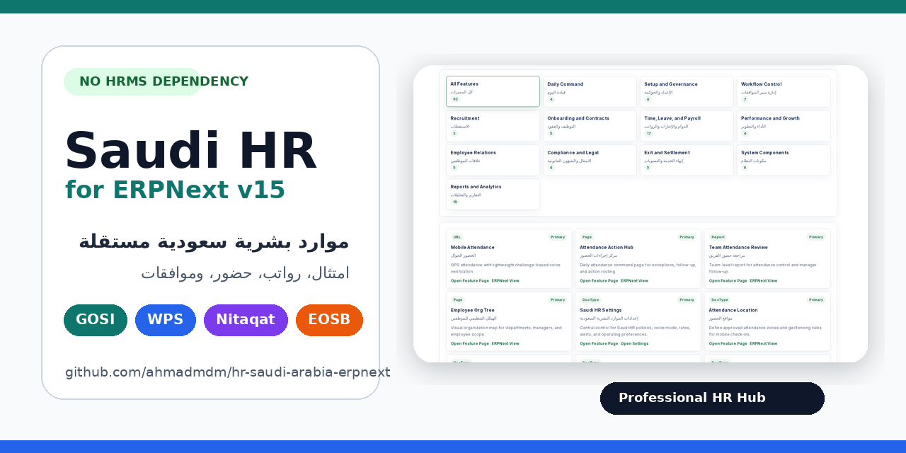

# Visual Tour

This page collects the product screenshots used in the GitHub README and release presentation.

## Professional HR Hub

The hub is the operating console for Saudi HR. It groups daily commands, feature coverage, operational areas, setup, governance, workflow control, reports, and navigation.

## Animated Tour

The GIF is intentionally short and lightweight so the README remains quick to load.

## Workspace

The workspace is organized around the way HR teams work: daily follow-up, employee operations, attendance, payroll, policies, compliance, and analytics.

## Reports

## Organization

## Social Preview Asset

Use `docs/images/social-preview.png` as the GitHub repository social preview image from the repository settings page.

